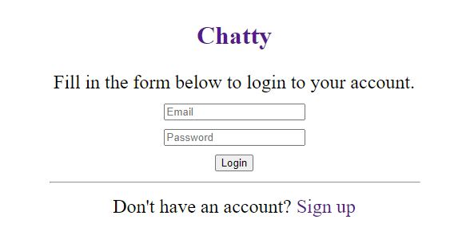
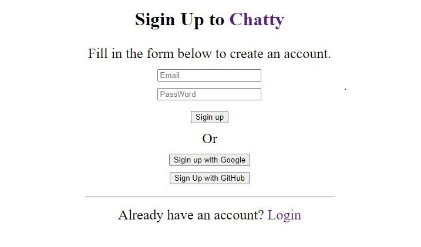
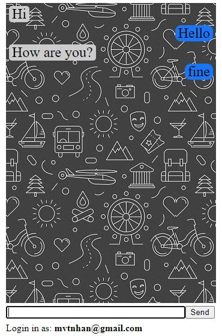

# A Real-Time Chat App with React and Firebase

An application called Chatty.

- It allows only authenticated users to send and read messages.
- Users can sign up by providing their email and creating a password, or by authenticating through a Google or GitHub account.

## Home page

 

## Sign up page

 

## Chat page

 

